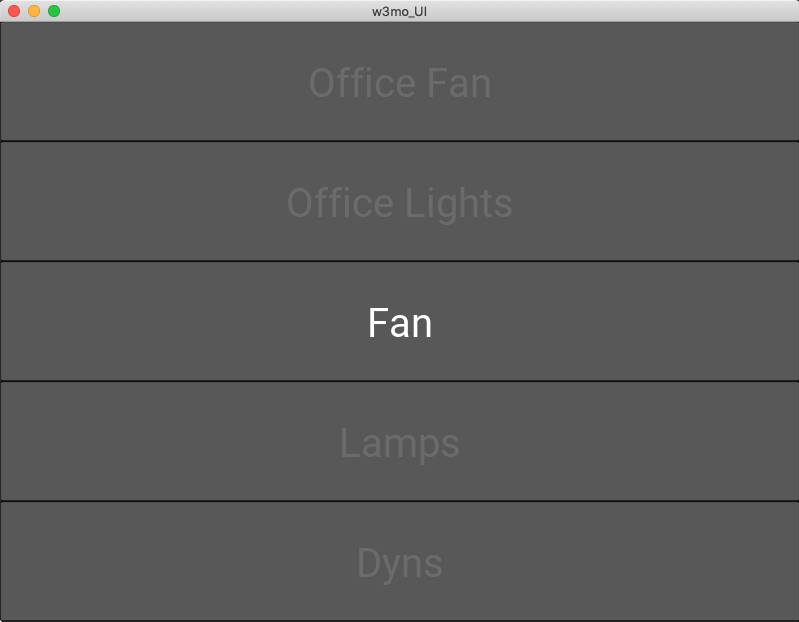

<span>[](https://pepy.tech/project/w3mo) 
[](https://pepy.tech/project/w3mo/month)
[](https://pepy.tech/project/w3mo/week)
[](https://lgtm.com/projects/g/mghelton/w3mo/context:python)
</span>

# Overview

w3mo is a pure python API wrapper for wemo devices

# Installation
```pip3 install w3mo```

# Usage
## Interactive "Shell" 
```python
from w3mo import w3mo
w3mo.interactive() #this mode will launch a "shell" to interact with discovered devices on your network
```

## Simple UI
* This operation runs a simple Kivy user interface that populates a list with all found devices




```bash
git clone https://github.com/mghelton/w3mo
cd ./w3mo
pip3 install .
python3 w3mo/ui.py
```

##  Device Discovery
```python
from w3mo import w3mo

#returns a dictionary of devices with the device name as the key
#{'name':{'ip':device_ip,'obj':instantiated w3mo control class}}
x = w3mo.discover(return_type=dict)

#returns a list of devices
#[{'name':'device_name_1','ip':'device_ip':,'obj':instantiated w3mo control class}]
x = w3mo.discover(return_type=list)
```

## Device Control
```python
from w3mo import w3mo
import time

devices = w3mo.discover(return_type=list)

#define device as the control class instantiation at index 0 of devices
device = devices[0]['obj']

#device name and state are set at instantiation and updated throughout use
print("Device Name = {}".format(device.name))
print("Device State = {}".format(device.state))

#turn on
device.set_state(1)


#time.sleep(.25)
#turn off
#device.set_state(0)
```

# Supported Devices

* NOTE: supported just means I had these devices / firmwares on hand for testing. Other devices SHOULD work, if you find something that doesn't fix it and submit a pull request!

<strong>Wemo Mini Smart Plug - F7C063</strong>

|Firmware Version                   |Supported          |
|:---                               |:---               |
|WeMo_WW_2.00.11452.PVT-OWRT-SNSV2  |:heavy_check_mark: |
|WeMo_WW_2.00.11420.PVT-OWRT-SNSV2  |:heavy_check_mark: |
|WeMo_WW_2.00.11326.PVT-OWRT-SNSV2  |:heavy_check_mark: |


<strong>Wemo WiFi Smart Light Switch - WLS040</strong>

|Firmware Version                       |Supported          |
|:---                                   |:---               |
|WeMo_WW_2.00.11451.PVT-OWRT-LIGHTV2    |:heavy_check_mark: |
|WeMo_WW_2.00.11395.PVT-OWRT-LIGHTV2    |:heavy_check_mark: |


